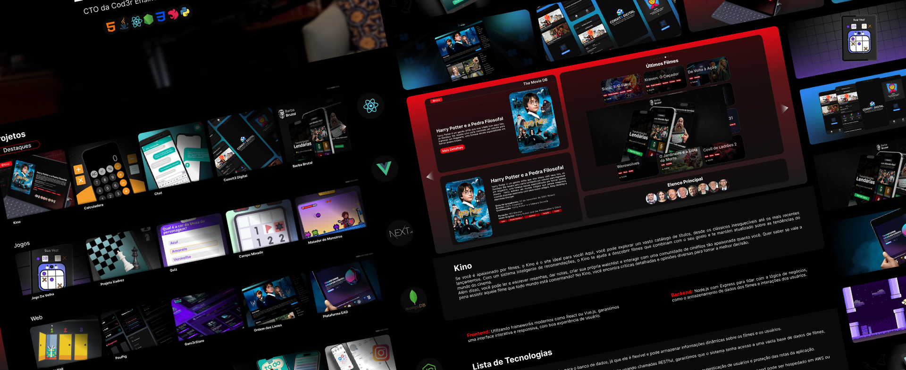

# Portfolio + AI Agents

<div align="center">


<div data-badges>


</div>

<div data-badges>


</div>
</div>

This is a full-stack application that integrates popular market technologies to create a digital showcase of a developer’s skills and projects. This platform goes beyond simply displaying past work, serving as a practical demonstration of the professional’s technical capabilities, demonstrating their mastery of modern web development.

In addition to showcasing the developer’s projects, the application incorporates intelligent AI agents that have full access to the professional’s resume, GitHub repositories, and history. This integration allows recruiters and potential clients to explore specific aspects of the developer’s technical skills through real-time interactions via chat. Chats with agents provide valuable insights, allowing visitors to ask questions and receive detailed information about the professional’s skills and experience, making the evaluation process more dynamic and informative.

## Running the project

### Requirements

-   Node.js installed

### Execution

1. Clone this repository:

```sh
git clone https://github.com/phgeek/ai-agents-portfolio.git
```

2. Access the project directory:

```sh
cd ai-agents-portfolio
```

3. Access your [Supabase](https://supabase.com/) account or create a new account.

4. Navigate to the project in Supabase and click the `connect` button.

5. Click select ORM and select the Prisma ORM.

6. Copy the listed environment variables, create a `.env` file in the backend folder and fill it with the following information:

    ```
    DATABASE_URL=
    DIRECT_URL=
    PORT=
    ```

    **Note: If the port value is not added, the application will run on port 4000 by default**

7. Create an account on the [n8n](https://n8n.io) website, and import the flow defined in the personal-assistant file that is in the assets folder.

8. After importing the flow, click on the first node, access `webhooks url`, click on `Production URL` and copy the value of this URL.
   **Note: Remember to activate the workflow in n8n**

9. Create a `.env` file in the web folder and fill it with the following information, where the API URL is the backend URL and the second variable must have as its value the URL that we extracted in n8n:

    ```
    NEXT_PUBLIC_API_URL=
    NEXT_PUBLIC_CHAT_WEBHOOK=
    ```

10. Install the dependencies of the `frontend` and `backend` projects with the `npm i` command in each of the folders.

11. Open the `frontend` and `backend` folders in two different terminals and run the `npm run dev` command in each of the terminals to run the project.

## Project Features

-   Project Viewing
-   AI Agent Integration via Chat
-   Integrated GitHub Repositories
-   Featured Technologies List
-   Project Technologies List
-   Search for projects by ID with associated technologies



## Useful links

-   [Next.js](https://nextjs.org/docs)
-   [NestJS](https://docs.nestjs.com/)
-   [Prisma](https://www.prisma.io)
-   [Supabase](https://supabase.com)
